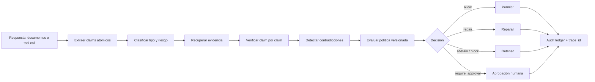
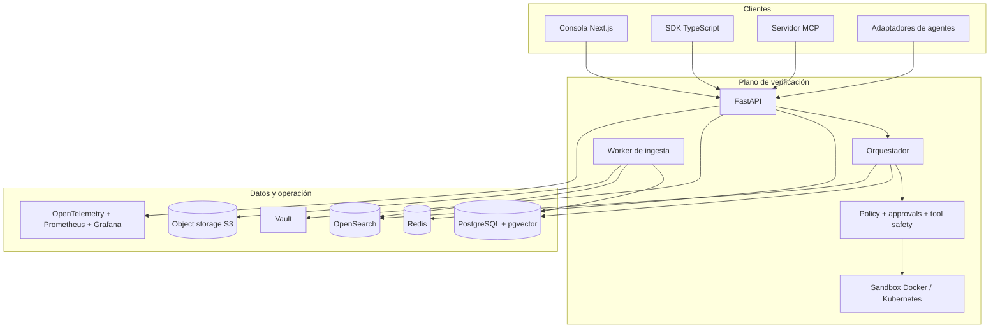

# Hallu Defense Platform

> Sistema de defensa contra alucinaciones para LLMs y agentes, basado en evidencia verificable, políticas formales y ejecución aislada.

[](https://github.com/Chocarlos/hallu-defense-platform/actions/workflows/ci.yml)
[](https://github.com/Chocarlos/hallu-defense-platform/actions/workflows/evals.yml)
[](https://github.com/Chocarlos/hallu-defense-platform/actions/workflows/security.yml)
[Apache-2.0](LICENSE)

Hallu Defense convierte respuestas y acciones en claims atómicos, recupera evidencia, aplica verificadores deterministas y políticas versionadas, y decide si debe permitir, citar, reparar, abstenerse, bloquear o solicitar aprobación humana.

Incluye API FastAPI, contratos públicos, SDK TypeScript, servidor MCP, adaptadores para agentes, consola Next.js, RAG híbrido, sandbox, persistencia, observabilidad y despliegue con Docker/Kubernetes.

**Madurez actual:** alpha técnica pública. El repositorio no presenta todavía una versión estable ni certifica un despliegue de producción concreto.

## Estado del proyecto

La aceptación integral más reciente corresponde exclusivamente al commit
`3bb45a548e4288934937f9397ce89710c53e7504` y a los runs identificados en el
[ledger de aceptación QA](docs/qa/2026-07-13-mass-qa-acceptance.md). No debe
extrapolarse a cambios posteriores.

La capa pública M7 llegó al estado `tested` para el candidato documentado, pero
eso no convierte automáticamente el `HEAD`, un release futuro o un entorno
externo en `accepted`.

| Área | Estado documentado | Límite actual |
| --- | --- | --- |
| API, contratos, SDK, MCP y consola | Implementados y cubiertos por gates | La aceptación histórica está ligada a commits exactos |
| Landing ES/EN y privacidad | `tested` en matrices locales de navegador | Faltan evidencias remotas y revisiones manuales finales |
| Demo intake | Deshabilitado por defecto | Requiere aprobación legal, secretos y servicios reales |
| Persistencia, identidad y observabilidad | Smokes locales aceptados para campañas concretas | No prueban infraestructura administrada externa |
| Worker de ingesta crash/restart | Pendiente/rechazado en la última aceptación | No debe presentarse como capacidad aceptada |
| Release público | Bloqueado hasta cerrar controles externos | Rama, tags, Environment y evidencia exacta siguen siendo gates |

Cada entorno debe completar sus propios checks de identidad, secretos, TLS,
restauración, carga, aislamiento y dependencias externas.

## Qué protege

| Superficie | Riesgo controlado | Respuesta de Hallu Defense |
| --- | --- | --- |
| Documentos y RAG | Claims sin soporte, evidencia obsoleta o contradictoria | Retrieval híbrido, autoridad/frescura, veredictos por claim, citas, reparación o abstención |
| Agentes con herramientas | Inputs inválidos, side effects, fuga de secretos/PII | Validación pre/post tool, rate limits, políticas, approvals y salida sanitizada |
| Agentes de código | Claims falsos sobre archivos, funciones, diffs, tests o builds | Inspección determinista y `SandboxRun` aislado |
| Operación enterprise | Mezcla de tenants, acceso indebido y falta de trazabilidad | OIDC, RBAC/ABAC, aislamiento tenant-aware, Vault, auditoría y cifrado |

Una afirmación sobre repositorios, tests, builds o artefactos no puede quedar
como soportada sin evidencia determinista de una inspección o ejecución real.

## Cómo funciona



Cada `VerificationRun` conserva tenant, `trace_id`, entrada, claims, evidencia,
veredictos, decisión final, versión de política y trazas de validación.

## Arquitectura



| Componente | Ubicación | Responsabilidad |
| --- | --- | --- |
| API y dominio | [`apps/api`](apps/api) | Verificación, RAG, políticas, seguridad, sandbox, auditoría y workers |
| Consola | [`apps/console`](apps/console) | Runs, evidencia, approvals, replay, evals y métricas |
| Contratos | [`packages/contracts`](packages/contracts) | JSON Schema y tipos TypeScript versionados |
| SDK | [`packages/sdk`](packages/sdk) | Cliente TypeScript tipado |
| MCP | [`packages/mcp-server`](packages/mcp-server) | Herramientas MCP/JSON-RPC por stdio |
| Adaptadores | [`packages/agent-adapters`](packages/agent-adapters) | Validación segura pre/post tool |
| Infraestructura | [`infra`](infra) | Docker, OPA, observabilidad y Helm/Kubernetes |
| Evaluaciones | [`evals`](evals) | Golden sets, runners, umbrales y reportes |

## Inicio rápido

### Requisitos

| Herramienta | Versión | Uso |
| --- | --- | --- |
| Python | Python 3.12 (`>=3.12,<3.13`) | API, workers, tests y scripts |
| Node.js | `24.18.0` | Workspaces TypeScript y consola |
| npm | `11.16.0` | Instalación reproducible |
| Docker | Compose v2 | Stack local y sandbox |
| GNU Make | Recomendado | Gates unificados |

### 1. Clonar y configurar

```bash
git clone https://github.com/Chocarlos/hallu-defense-platform.git
cd hallu-defense-platform
cp .env.example .env
```

En PowerShell:

```powershell
Copy-Item .env.example .env
```

`HALLU_DEFENSE_ALLOWED_WORKSPACE=.` limita el sandbox al directorio de arranque.
Los valores de `.env.example` son solo fixtures locales y no son secretos aptos
para producción.

### 2. Instalar Python

Windows:

```powershell
py -3.12 -m venv .venv
.venv\Scripts\python.exe -m pip install --upgrade pip
.venv\Scripts\python.exe -m pip install -e "apps/api[dev]"
```

Linux o macOS:

```bash
python3.12 -m venv .venv
.venv/bin/python -m pip install --upgrade pip
.venv/bin/python -m pip install -e "apps/api[dev]"
```

Para reproducir el lock Linux exacto:

```bash
.venv/bin/python scripts/ci/install_python_lock.py dev
.venv/bin/python -m pip install --no-deps -e apps/api
```

### 3. Instalar TypeScript

```bash
npm ci
```

No regeneres `package-lock.json` para corregir una versión incompatible de
Node/npm; usa primero los engines declarados en `package.json`.

### 4. Iniciar API y consola

Terminal 1:

```powershell
.venv\Scripts\python.exe -m uvicorn hallu_defense.main:app --reload --port 8000
```

En POSIX usa `.venv/bin/python`. Terminal 2:

```bash
npm run dev:console
```

- API y Swagger: <http://localhost:8000> y <http://localhost:8000/docs>
- Landing ES/EN: <http://localhost:3000/> y <http://localhost:3000/en>
- Consola: <http://localhost:3000/console>
- Health/readiness: <http://localhost:8000/health> y <http://localhost:8000/ready>

### 5. Ejecutar una verificación

```bash
curl --request POST http://localhost:8000/verification/run \
  --header "Content-Type: application/json" \
  --header "x-tenant-id: local-dev" \
  --data '{
    "tenant_id": "local-dev",
    "message_text": "Los empleados reciben 15 días de vacaciones.",
    "task_type": "document_qa",
    "documents": [{
      "source_ref": "manual-rh-v7",
      "content": "Los empleados reciben 15 días de vacaciones.",
      "authority": "internal"
    }]
  }'
```

La operación pública representativa es `POST /verification/run`. La respuesta
debe contener `trace_id`, claims, evidencia, veredictos y `final_decision`.

## Stack local completo con Docker Compose

```bash
docker compose up --build -d
docker compose ps
docker compose logs -f api ingestion-worker
```

Servicios principales:

| Servicio | Puerto | Propósito |
| --- | ---: | --- |
| API / consola | `8000` / `3000` | Verificación y experiencia DevEx |
| PostgreSQL / OpenSearch | `5432` / `9200` | Persistencia relacional, vectorial y BM25 |
| Redis / S3-compatible | `6379` / `9000` | Cuotas, coordinación, corpus y backups |
| Keycloak / Vault | `8081` / `8200` | Identidad y secretos locales |
| Prometheus / Grafana | `9090` / `3001` | Métricas y dashboards |
| OTLP | `4317`, `4318` | Recepción de telemetría |

```bash
make sandbox-image
make sandbox-live-smoke
```

Detén el perfil sin borrar volúmenes con `docker compose down`. Usa `-v` solo
cuando quieras eliminar deliberadamente los datos locales.

## Superficies públicas

### API, SDK, MCP y adaptadores

La especificación vive en [`docs/api/openapi.yaml`](docs/api/openapi.yaml). Las
familias principales cubren estado, claims, evidencia, ingesta, RAG,
verificación, tool safety, políticas, approvals, sandbox, auditoría y evals.

El SDK `@hallu-defense/sdk`, el servidor `@hallu-defense/mcp-server` y
`@hallu-defense/agent-adapters` permanecen como workspaces del monorepo; todavía
no deben presentarse como paquetes públicos publicados.

### Providers de modelos

| Backend | Implementación actual | Evidencia y límite |
| --- | --- | --- |
| `mock` | Determinista y sin red | Desarrollo/tests; rechazado en producción-like |
| `openai-compatible` | `/chat/completions` configurable | Tests offline; conectividad externa depende del entorno |
| `ollama` | `/api/chat` local | Tests offline y smoke opt-in local |

La selección usa `HALLU_DEFENSE_PROVIDER_BACKEND`. Las credenciales se resuelven
mediante `SecretManager`/Vault; no se pasan claves crudas a la lógica de negocio.
Consulta [providers](docs/security/providers.md) y
[gestión de secretos](docs/security/secrets.md).

## Modelo de seguridad

- OIDC y RBAC/ABAC en staging/production.
- Tenant derivado de identidad verificada y comprobado en API, RAG, persistencia y auditoría.
- Aprobación humana y grant de un solo uso para acciones de alto riesgo.
- Redacción de PII, secretos y credenciales.
- Audit ledger, replay controlado y exportación acotada.
- Sandbox sin red por defecto y filesystem limitado.
- Egress HTTPS por allowlist; redirects bloqueados.
- Vault-compatible secret resolution y rotación.
- Gitleaks, auditoría de dependencias y escaneo Trivy en CI.

Los perfiles `staging` y `production` fallan cerrados si faltan identidad,
persistencia, TLS, secretos o aislamiento requeridos. Revisa [`SECURITY.md`](SECURITY.md)
y no publiques vulnerabilidades ni datos sensibles en issues.

## Desarrollo y validación

Ejecuta los gates desde la raíz:

```bash
make lint
make typecheck
make test
make build
make contracts
make openapi-check
make policy-test
make sandbox-test
make evals-smoke
make security-check
make foundation-docs-check
make foundation-infra-check
make traceability-check
make worklog-check
```

La suite Python selecciona la lane compatible con el host:

```powershell
.venv\Scripts\python.exe -m pytest apps/api/tests --suite-lane=auto
```

Los smokes `live` son opt-in y requieren dependencias aprovisionadas. No debilites
una política, un test o un default seguro para obtener verde.

## Despliegue

La plataforma incluye Compose local, un overlay de producción validado
estáticamente y un chart Helm:

- [Perfil de producción](docs/deployment/production-profile.md)
- [Marketing, demo intake y compatibilidad web](docs/deployment/marketing-launch.md)
- [Despliegue Helm/Kubernetes](docs/deployment/kubernetes-helm.md)
- [Proceso de release](docs/security/release-process.md)
- [Controles externos del repositorio](docs/governance/repository-controls.md)

No promociones un entorno usando únicamente resultados locales. Verifica
OIDC/Vault/TLS, restore, aislamiento tenant-aware, dependencias externas y
evidencia inmutable para el release y despliegue exactos.

## Documentación y gobierno

- [Plan maestro](docs/PLAN_MASTER.md)
- [Matriz de trazabilidad](docs/TRACEABILITY_MATRIX.md)
- [Worklog](docs/WORKLOG.md)
- [OpenAPI](docs/api/openapi.yaml)
- [Changelog](CHANGELOG.md)
- [Contribución](CONTRIBUTING.md)
- [Código de conducta](CODE_OF_CONDUCT.md)
- [Seguridad](SECURITY.md)
- [Licencia y atribución](docs/legal/licensing.md)

El repositorio gobierna el progreso con evidencia: `accepted` exige
implementación, tests, documentación y validación reproducible para el objeto
exacto evaluado.

## Licencia

Copyright 2026 Xocarlos.

El código y la documentación cubiertos se distribuyen bajo
[Apache License 2.0](LICENSE). Las dependencias y componentes externos conservan
sus propias licencias; consulta la [política de atribución](docs/legal/licensing.md).

## Contribuir

Lee [`AGENTS.md`](AGENTS.md) y [`CONTRIBUTING.md`](CONTRIBUTING.md), trabaja en
una rama acotada y mantén sincronizados código, tests, contratos, trazabilidad y
worklog. Antes de abrir un PR, ejecuta los gates proporcionales y revisa
`git diff --check`.
