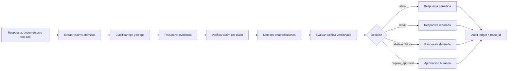
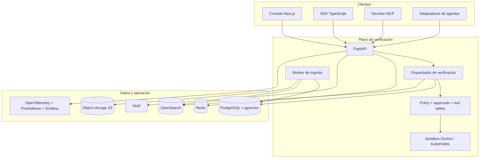

# Hallu Defense Platform

> Sistema de defensa contra alucinaciones para LLMs y agentes, basado en evidencia verificable, políticas formales y ejecución aislada.

[](https://github.com/Chocarlos/hallu-defense-platform/actions/workflows/ci.yml)
[](https://github.com/Chocarlos/hallu-defense-platform/actions/workflows/evals.yml)
[](https://github.com/Chocarlos/hallu-defense-platform/actions/workflows/security.yml)

Hallu Defense es una plataforma enterprise, híbrida y agnóstica de proveedor que verifica respuestas de modelos, acciones de agentes y afirmaciones sobre código antes de tratarlas como confiables. Convierte cada respuesta en claims atómicos, recupera evidencia real, aplica reglas deterministas y políticas versionadas, y decide si debe permitir, reparar, abstenerse, bloquear o solicitar aprobación humana.

El repositorio contiene el plano de verificación FastAPI, contratos públicos sincronizados, SDK TypeScript, servidor MCP, adaptadores para tool calling, consola Next.js, workers de ingesta, persistencia híbrida, observabilidad, seguridad y despliegue con Docker/Kubernetes.

## Estado del proyecto

La plataforma está implementada y cubierta por validación local, CI y pruebas live controladas. La campaña integral más reciente dejó verdes los gates secuenciales de lint, tipos, tests, build, seguridad, contratos y evaluaciones; la evidencia exacta y sus límites están en el [ledger de aceptación QA](docs/qa/2026-07-13-mass-qa-acceptance.md).

Esto no equivale a certificar cualquier despliegue como listo para producción: cada entorno debe completar sus propios checks de infraestructura, identidad, secretos, restauración y carga. En particular, el smoke de recuperación del worker de ingesta tras crash/restart permanece rechazado hasta resolver su causa raíz; no se presenta como evidencia aceptada.

## Qué protege

| Superficie | Riesgo que controla | Respuesta de la plataforma |
| --- | --- | --- |
| Documentos y RAG | Respuestas sin soporte, evidencia insuficiente, fuentes obsoletas o contradictorias | Extracción de claims, retrieval híbrido, autoridad/frescura, veredictos por claim, citas, reparación o abstención |
| Agentes con herramientas | Inputs inválidos, side effects, fuga de secretos/PII, outputs contradictorios | Validación pre/post tool, catálogo confiable, rate limits, políticas, approvals y salida sanitizada |
| Agentes de código | Claims falsos sobre archivos, funciones, diffs, tests o builds | Inspección determinista y `SandboxRun` aislado; red y filesystem cerrados por defecto |
| Operación enterprise | Mezcla de tenants, acceso indebido, falta de trazabilidad o secretos expuestos | OIDC, RBAC/ABAC, aislamiento tenant-aware, Vault, audit ledger, cifrado, métricas y trazas |

La regla central es deliberadamente estricta: una afirmación sobre repositorios, tests, builds o artefactos no puede quedar como soportada sin evidencia determinista de una ejecución o inspección real.

## Cómo funciona



Cada `VerificationRun` conserva el `trace_id`, tenant, entrada, claims, evidencia, veredictos, decisión final, versión de política y trazas de validación necesarias para explicar el resultado.

## Arquitectura



| Componente | Ubicación | Responsabilidad |
| --- | --- | --- |
| API y dominio | [`apps/api`](apps/api) | Endpoints FastAPI, pipeline, RAG, políticas, seguridad, sandbox, auditoría y workers |
| Consola | [`apps/console`](apps/console) | Runs, claims, evidencia, veredictos, approvals, sandbox, replay, evals y métricas |
| Contratos | [`packages/contracts`](packages/contracts) | JSON Schema, tipos TypeScript, versiones y ejemplos válidos/inválidos |
| SDK | [`packages/sdk`](packages/sdk) | Cliente TypeScript tipado para la API pública |
| MCP | [`packages/mcp-server`](packages/mcp-server) | Servidor MCP/JSON-RPC por stdio con validación estricta de entrada y salida |
| Adaptadores | [`packages/agent-adapters`](packages/agent-adapters) | Envoltura segura pre/post ejecución para herramientas de agentes |
| Infraestructura | [`infra`](infra) | Imágenes, OPA/Rego, OpenTelemetry, Prometheus, Grafana y Helm/Kubernetes |
| Evaluaciones | [`evals`](evals) | Golden sets, escenarios, runners, umbrales y reportes |

## Inicio rápido

### Requisitos

| Herramienta | Versión requerida o recomendada | Uso |
| --- | --- | --- |
| Python | Python 3.12 (`>=3.12,<3.13`) | API, workers, tests y scripts |
| Node.js | `24.18.0` | SDK, MCP y consola |
| npm | `11.16.0` | Workspaces TypeScript reproducibles |
| Docker | Docker Engine/Desktop con Compose v2 | Stack local, dependencias y sandbox |
| GNU Make | Recomendado | Gates unificados del repositorio |
| Git | Versión moderna | Clonar y colaborar |

Las versiones exactas de Node/npm están declaradas en [`package.json`](package.json). Los locks Python con hashes apuntan a CPython `3.12.13` sobre Linux; el flujo editable que sigue funciona con cualquier Python admitido por `pyproject.toml`.

### 1. Clonar y configurar

```bash
git clone https://github.com/Chocarlos/hallu-defense-platform.git
cd hallu-defense-platform
cp .env.example .env
```

En PowerShell, copia la configuración con:

```powershell
Copy-Item .env.example .env
```

`HALLU_DEFENSE_ALLOWED_WORKSPACE=.` limita el sandbox al directorio desde el que arranca el proceso. Si inicias la API desde otro lugar, reemplázalo por la ruta absoluta de este checkout. Los valores y credenciales locales del ejemplo no son secretos aptos para producción.

### 2. Instalar Python

Desde la raíz del repositorio, en Windows:

```powershell
py -3.12 -m venv .venv
.venv\Scripts\python.exe -m pip install --upgrade pip
.venv\Scripts\python.exe -m pip install -e "apps/api[dev]"
```

En Linux o macOS:

```bash
python3.12 -m venv .venv
.venv/bin/python -m pip install --upgrade pip
.venv/bin/python -m pip install -e "apps/api[dev]"
```

Para reproducir el entorno CI exacto en Linux con CPython `3.12.13`, usa el instalador de locks con hashes:

```bash
.venv/bin/python scripts/ci/install_python_lock.py dev
.venv/bin/python -m pip install --no-deps -e apps/api
```

### 3. Instalar los workspaces TypeScript

```bash
npm ci
```

`npm ci` usa [`package-lock.json`](package-lock.json) sin recalcular dependencias. Si Node o npm no coinciden con los engines declarados, corrige primero el runtime en vez de regenerar el lock.

### 4. Iniciar API y consola

Terminal 1:

```powershell
.venv\Scripts\python.exe -m uvicorn hallu_defense.main:app --reload --port 8000
```

En Linux/macOS cambia el ejecutable por `.venv/bin/python`. Terminal 2:

```bash
npm run dev:console
```

Servicios principales:

- API: <http://localhost:8000>
- Swagger UI: <http://localhost:8000/docs>
- OpenAPI JSON: <http://localhost:8000/openapi.json>
- Landing ES: <http://localhost:3000/>
- Landing EN: <http://localhost:3000/en>
- Privacidad ES/EN: <http://localhost:3000/privacy> y <http://localhost:3000/en/privacy>
- Consola DevEx autenticada: <http://localhost:3000/console>
- Health: <http://localhost:8000/health>
- Readiness: <http://localhost:8000/ready>

El perfil local usa autenticación por headers sin firma, provider `mock`, índices RAG locales y backends de memoria donde corresponde. Ese modo existe únicamente para desarrollo; `staging` y `production` fallan cerrados si faltan OIDC, TLS, Vault, persistencia o aislamiento requerido.

### 5. Ejecutar una verificación

Con la API activa:

```bash
curl --request POST http://localhost:8000/verification/run \
  --header "Content-Type: application/json" \
  --header "x-tenant-id: local-dev" \
  --data '{
    "tenant_id": "local-dev",
    "message_text": "Los empleados de tiempo completo reciben 15 días de vacaciones pagadas al año.",
    "task_type": "document_qa",
    "documents": [
      {
        "source_ref": "manual-rh-v7",
        "content": "Los empleados de tiempo completo reciben 15 días de vacaciones pagadas al año.",
        "authority": "internal"
      }
    ]
  }'
```

En PowerShell, el equivalente nativo es:

```powershell
$body = @{
  tenant_id = "local-dev"
  message_text = "Los empleados de tiempo completo reciben 15 días de vacaciones pagadas al año."
  task_type = "document_qa"
  documents = @(@{
    source_ref = "manual-rh-v7"
    content = "Los empleados de tiempo completo reciben 15 días de vacaciones pagadas al año."
    authority = "internal"
  })
} | ConvertTo-Json -Depth 5

Invoke-RestMethod `
  -Method Post `
  -Uri http://localhost:8000/verification/run `
  -Headers @{ "x-tenant-id" = "local-dev" } `
  -ContentType "application/json" `
  -Body $body
```

La respuesta debe incluir un `trace_id`, ledger de claims y veredictos, evidencia enlazada y `final_decision`. El tenant del body debe coincidir con la identidad autenticada o el header local; una discrepancia se rechaza.

## Stack local completo con Docker Compose

Para levantar API, consola, worker, datos, identidad, secretos y observabilidad:

```bash
docker compose up --build -d
docker compose ps
docker compose logs -f api ingestion-worker
```

Detener sin borrar volúmenes:

```bash
docker compose down
```

| Servicio | URL/puerto host | Propósito |
| --- | --- | --- |
| API | `8000` | Plano de verificación FastAPI |
| Consola | `3000` | Interfaz DevEx Next.js |
| PostgreSQL + pgvector | `5432` | Persistencia relacional y vectorial |
| OpenSearch | `9200` | BM25, metadatos e índice híbrido |
| Redis | `6379` | Cuotas/rate limits y coordinación opcional |
| Object storage S3-compatible | `9000` | Corpus, backups y artefactos |
| Keycloak | `8081` | Proveedor OIDC local |
| Vault | `8200` | Secret manager local/compatible |
| Prometheus | `9090` | Métricas |
| Grafana | `3001` | Dashboards |
| OpenTelemetry Collector | `4317`, `4318` | Recepción OTLP gRPC/HTTP |

Los servicios `postgres-migrations` y `opensearch-bootstrap` son jobs de inicialización sin puerto público. `ingestion-worker` procesa la ingesta asíncrona y tampoco expone puerto host.

Para ejecutar checks de repositorio en aislamiento, construye también la imagen del sandbox:

```bash
make sandbox-image
make sandbox-live-smoke
```

Docker Compose es un perfil local. No uses `docker compose down -v` salvo que quieras eliminar deliberadamente todos los datos locales.

## Superficies públicas

### API REST

La especificación completa y versionada vive en [`docs/api/openapi.yaml`](docs/api/openapi.yaml). Las principales familias son:

| Familia | Endpoints representativos |
| --- | --- |
| Estado y observabilidad | `GET /health`, `GET /ready`, `GET /metrics` |
| Claims y evidencia | `POST /claims/extract`, `/claims/classify`, `/evidence/retrieve`, `/claims/verify` |
| Ingesta y RAG | `POST /documents/ingest`, `/documents/ingest/status`, `/rag/corpus-grants/*` |
| Verificación | `POST /verification/run`, `/v2/verification/run`, `/verification/replay`, `/verification/runs/list` |
| Tool safety | `POST /tools/validate-input`, `/tools/validate-output` |
| Políticas y approvals | `POST /policy/evaluate`, `/approvals/list`, `/approvals/decide` |
| Código y sandbox | `POST /repo/checks/run` |
| Auditoría y evals | `POST /audit/export`, `/evals/reports/publish`, `/evals/reports/list` |

Consulta la [guía de API](docs/api/README.md), la [migración v1 → v2](docs/api/v1-to-v2-migration.md) y la [historia/replay de verificaciones](docs/api/verification-history.md) antes de integrar contratos públicos.

### SDK TypeScript

`@hallu-defense/sdk` es un workspace privado y tipado que consume los contratos sincronizados. Expone, entre otros, `runVerification()`, `retrieveEvidence()`, `ingestDocuments()`, `verifyClaims()`, `validateToolInput()`, `validateToolOutput()`, `runRepoChecks()`, `repairResponse()`, `exportAudit()` y operaciones de approvals/replay.

```ts
import { HalluDefenseClient } from "@hallu-defense/sdk";

const client = new HalluDefenseClient({
  baseUrl: "http://localhost:8000",
  tenantId: "local-dev"
});

const run = await client.runVerification({
  tenant_id: "local-dev",
  message_text: "La política interna permite esta acción.",
  task_type: "document_qa",
  documents: []
});

console.log(run.trace_id, run.final_decision);
```

### Servidor MCP

El workspace `@hallu-defense/mcp-server` implementa MCP/JSON-RPC 2.0 por stdio y publica herramientas tipadas para ingesta, estado de ingesta, verificación de claims, retrieval, validación pre/post tool, repo checks, explicación de políticas y reparación.

```bash
npm run mcp
```

Producción requiere origen HTTPS y token OIDC cargado desde archivo; consulta el [README del servidor MCP](packages/mcp-server/README.md) para el handshake, límites, redacción de errores y rotación del bearer.

### Adaptadores para agentes

`@hallu-defense/agent-adapters` envuelve una ejecución con validación pre-tool, autorización/grant de un solo uso cuando aplica, validación post-tool y entrega exclusiva de la salida sanitizada. La [guía de adaptadores](packages/agent-adapters/README.md) documenta el límite de confianza y el contrato de output.

## Datos, retrieval e ingesta

El modo local puede trabajar con índices en memoria. Los perfiles persistentes combinan:

- OpenSearch para BM25, filtros y metadatos.
- PostgreSQL/pgvector para búsqueda vectorial y estado durable.
- Reranking, autoridad, freshness, fuentes contradictorias y referencias estables.
- Object storage S3-compatible para corpus, artefactos y backups cifrados.
- Grants de corpus tenant-aware para impedir retrieval cruzado.
- Worker asíncrono con leases y estados consultables para ingesta.

Guías operativas:

- [Índices RAG persistentes](docs/rag/persistent-indexes.md)
- [Migraciones PostgreSQL](docs/rag/postgres-migrations.md)
- [Backfill de RAG](docs/rag/backfill.md)
- [Object storage S3-compatible](docs/deployment/s3-compatible-object-storage.md)

## Providers de modelos

El backend de provider se selecciona con `HALLU_DEFENSE_PROVIDER_BACKEND`:

- `mock`: determinista y predeterminado para desarrollo/tests.
- OpenAI-compatible: cualquier endpoint que implemente el contrato compatible.
- Ollama: modelos locales sin acoplar la lógica de negocio al proveedor.

Las credenciales se resuelven por nombre lógico mediante `SecretManager`/Vault; no se pasan claves crudas a la lógica de negocio ni se deben guardar en `.env`, argumentos, imágenes o logs. Consulta [providers](docs/security/providers.md) y [gestión de secretos](docs/security/secrets.md).

## Modelo de seguridad

- Identidad OIDC y autorización RBAC/ABAC en staging/production.
- Tenant derivado de identidad verificada y comprobado en API, RAG, persistencia y auditoría.
- Acciones de alto riesgo bloqueadas hasta una aprobación humana vinculada y un grant de ejecución de un solo uso.
- Redacción de PII, secretos y credenciales antes de devolver o registrar outputs.
- Audit ledger append-only con commitments, replay controlado y exportación acotada.
- Sandbox Docker local y Kubernetes tenant-bound en producción, sin red por defecto, filesystem limitado y comandos controlados.
- Egress HTTPS por allowlist; TLS y cifrado en reposo obligatorios en perfiles enterprise.
- Vault-compatible secret resolution, rotación y materialización segura de tokens.
- CI con secret scanning, dependency audit, gates de configuración y escaneo Trivy de imágenes.

Los perfiles `staging` y `production` son fail-closed: no degradan silenciosamente a headers sin firma, backends en memoria, HTTP sin verificar, subprocess del host o secretos directos para arrancar. Revisa [`SECURITY.md`](SECURITY.md), [auth/RBAC](docs/security/auth-rbac.md), [approvals](docs/security/approvals.md), [audit ledger](docs/security/audit-ledger.md) y [cifrado](docs/security/encryption-at-rest-and-transit.md).

## Desarrollo y validación

Ejecuta los gates desde la raíz. El `Makefile` detecta `.venv` tanto en Windows como en POSIX.

```bash
make lint
make typecheck
make test
make build
make contracts
make openapi-check
make policy-test
make sandbox-test
make evals-smoke
make security-check
make marketing-e2e-list
make browserstack-marketing-config
```

Gates documentales y de configuración:

```bash
make foundation-docs-check
make foundation-infra-check
make traceability-check
make worklog-check
```

La suite Python selecciona automáticamente la lane compatible con el host:

```bash
.venv/Scripts/python.exe -m pytest apps/api/tests --suite-lane=auto
```

En POSIX usa `.venv/bin/python`. Las pruebas marcadas `windows`, `posix`, `linux` o `live` no se falsean como skipped: el selector las ejecuta o las reporta como `deselected` según la plataforma. Los smokes live son opt-in y requieren aprovisionar explícitamente sus dependencias.

Si cambias contratos públicos, valida JSON Schema, Pydantic, TypeScript, OpenAPI y SDK. Si cambias políticas o sandbox, ejecuta además los gates especializados correspondientes. No debilites una política, test o default seguro para obtener verde.

## Despliegue

La plataforma incluye Compose para desarrollo, perfil de producción validado y chart Helm para Kubernetes:

- [Perfil de producción](docs/deployment/production-profile.md)
- [Lanzamiento de marketing, captación y compatibilidad web](docs/deployment/marketing-launch.md)
- [Despliegue Helm/Kubernetes](docs/deployment/kubernetes-helm.md)
- [Sandbox Jobs en Kubernetes](docs/deployment/kubernetes-sandbox-jobs.md)
- [Materialización del bearer de métricas](docs/deployment/metrics-bearer-token-materializer.md)
- [Proceso de release](docs/security/release-process.md)
- [Backup, restore y retention](docs/security/backup-restore-retention.md)

No promociones un entorno usando solamente resultados locales. Ejecuta los gates del perfil objetivo, verifica OIDC/Vault/TLS, prueba restore con datos scratch, valida aislamiento tenant-aware y conserva evidencia inmutable del release.

## Estructura del repositorio

```text
.
├── apps/
│   ├── api/                 # FastAPI, dominio, workers y tests Python
│   └── console/             # Consola Next.js
├── packages/
│   ├── contracts/           # JSON Schemas y tipos públicos
│   ├── sdk/                 # SDK TypeScript
│   ├── agent-adapters/      # Integración segura con tool calling
│   └── mcp-server/          # Servidor MCP/JSON-RPC stdio
├── docs/
│   ├── adr/                 # Decisiones de arquitectura
│   ├── api/                 # OpenAPI y guías de migración
│   ├── deployment/          # Operación y despliegue
│   ├── qa/                  # Evidencia de campañas QA
│   ├── rag/                 # Persistencia, migraciones y backfill
│   └── security/            # Controles y runbooks de seguridad
├── evals/                   # Golden sets, escenarios y reportes
├── infra/                   # Docker, OPA, observabilidad y Helm
├── requirements/python/     # Locks Python con hashes por perfil
├── scripts/                 # Gates CI y smokes live
├── docker-compose.yml
└── Makefile
```

## Documentación y gobierno

- [Plan maestro](docs/PLAN_MASTER.md): alcance, arquitectura objetivo y milestones.
- [Matriz de trazabilidad](docs/TRACEABILITY_MATRIX.md): requisito → implementación → tests → evidencia → riesgo.
- [Worklog](docs/WORKLOG.md): cambios y comandos ejecutados en orden cronológico.
- [ADRs](docs/adr): decisiones técnicas y sus consecuencias.
- [OpenAPI](docs/api/openapi.yaml): contrato REST generado y verificado.
- [Contribución](CONTRIBUTING.md): flujo de cambios, calidad y revisión.
- [Seguridad](SECURITY.md): reporte de vulnerabilidades y postura de seguridad.

El repositorio gobierna el progreso con evidencia: un requisito no se marca `accepted` sin implementación, tests, documentación y validación reproducible. Los resultados de una máquina o campaña se reportan con sus límites; nunca se convierten en una afirmación global sin respaldo.

## Contribuir

Lee [`AGENTS.md`](AGENTS.md) y [`CONTRIBUTING.md`](CONTRIBUTING.md), trabaja en una rama acotada y mantén sincronizados código, tests, contratos, trazabilidad y worklog. Antes de abrir un PR, ejecuta al menos los gates proporcionales al cambio y revisa `git diff --check`.

Los reportes de vulnerabilidades deben seguir el canal privado indicado en [`SECURITY.md`](SECURITY.md); no publiques secretos, exploits activos ni datos de tenants en issues.
